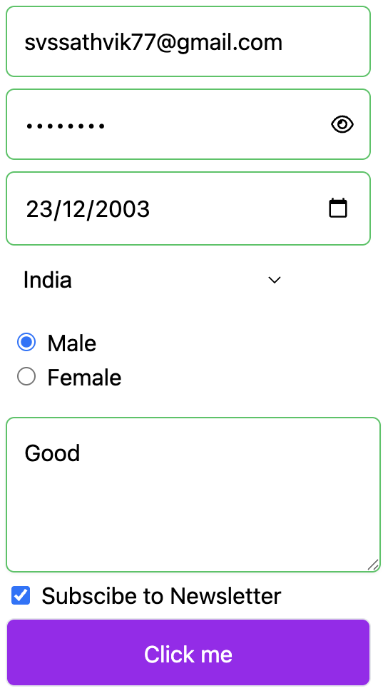

# React Form Component Library

## Overview

The React Form Component Library provides a set of reusable and customizable form components designed to simplify form handling in React applications. The library includes several `input` components, which are flexible and easy to integrate into any project.

```jsx
import {DropDown} from "react-forms-ts";
import { FormProvider } from "react-forms-ts";
import {InputBox} from "react-forms-ts";
import {RadioButton} from "react-forms-ts";
import "react-forms-ts/dist/styles.css"

const App = () => {
  const emailValidity = (data:string)=>{
    const emailRegex = /^[a-zA-Z0-9._%+-]+@[a-zA-Z0-9.-]+\.[a-zA-Z]{2,}$/;
    return emailRegex.test(data);
  }
  return (
      <FormProvider submitFunc={(data:string)=>{alert(data)}}>
        <InputBox fieldKey='email' required={true} placeholder='Enter email' value={""} validateFunc={emailValidity} defaultErrorText='enter valid email' type='email' minLength={5}/>
        <InputBox fieldKey='dob' required={true} placeholder='enter date' value={""} validateFunc={()=>{return true;}} defaultErrorText='enter valid date' type='date'/>
        <DropDown 
          fieldKey='country' 
          required={true} 
          options={["India", "USA", "Canada"]} 
          value={""} 
          width="200px" 
          height="40px" 
          color="black" 
          bgColor="transparent" 
          font="Arial" 
        />
        <InputBox fieldKey='password' required={true} placeholder='enter passoword' value={""} validateFunc={()=>{return true;}} defaultErrorText='enter valid password' type='password'/>
        <RadioButton fieldKey='gender' required={true} options={["Male","Female"]} value={""}/>
        <InputBox fieldKey='submit' required={false} placeholder='something' value={"Click me"} validateFunc={()=>{return true;}} defaultErrorText='enter valid dob' type='submit' bgColor="#A020F0" height="3rem" color="white"/>
      </FormProvider>
  );
};

export default App;
```


## Features

- Supports multiple input types including text, email, password, file uploads, date, telephone, and buttons.
- Customizable styles through props and class names.
- Integration of custom validation logic.
- Easy to use with hooks for managing form state.
- Micro-animations, animated error UI
- Integrated Debouncer with custom debounce delay

## Table of Contents

- [Installation](#installation)
- [Usage](#usage)
  - [FormProvider](#formprovider)
  - [InputBox](#inputbox)
  - [RadioButton](#radiobutton)
  - [DropDownButton](#dropdown)
  - [Button](#button)
- [Props](#props)
  - [InputBox Props](#inputbox-props)
  - [RadioButton Props](#radiobutton-props)
- [Customizations](#customization)

## Installation

You can install the package via npm or yarn:

```bash
npm install react-forms-ts
```

or

```bash
yarn add react-forms-ts
```

## Usage  
### Import styling
To use the `react-forms-ts` package, make sure to import the styles in your project. Add the following line in your main application file or wherever you use the components:
```javascript
import 'react-forms-ts/dist/styles.css';
```
### FormProvider
The `FormProvider` component wraps your form and manages the form state and validation logic across all child components. It ensures that validation functions and form states are accessible and consistent throughout the form.  

```jsx
<FormProvider>
  <InputBox/>
</FormProvider>
```

### InputBox

The `InputBox` component is a versatile input field that supports various types:

- `text`
- `email`
- `password`
- `textarea`
- `date`
- `file`
- `tel`
- `button`

#### Example

```jsx
import {InputBox} from 'react-forms-ts';
import { FormProvider } from 'react-forms-ts';

const App = () => {
  const emailValidity = (data:string)=>{
    const emailRegex = /^[a-zA-Z0-9._%+-]+@[a-zA-Z0-9.-]+\.[a-zA-Z]{2,}$/;
    return emailRegex.test(data);
  }
  return (
      <FormProvider>
        <InputBox fieldKey='email' required={true} placeholder='Enter email' value={""} validateFunc={emailValidity} defaultErrorText='enter valid email' type='email'/>
      </FormProvider>
  );
};
```


### RadioButton

The `RadioButton` component allows users to select one option from a list of choices.

#### Example

```jsx
import {InputBox} from 'react-forms-ts';
import {RadioButton} from 'react-forms-ts';
import { FormProvider } from 'react-forms-ts';

const App = () => {
  return (
      <FormProvider>
        <RadioButton fieldKey='country' required={true} options={["India","USA","Canada"]} value={""}/>
      </FormProvider>
  );
};


export default App
```

### DropDown

The `DropDown` component allows users to select an option from a dropdown list.
#### Example

```jsx
import {DropDown} from 'react-forms-ts';
import { FormProvider } from 'react-forms-ts';

const App = () => {
  return (
      <FormProvider>
        <DropDown 
          fieldKey='country' 
          required={true} 
          options={["India", "USA", "Canada"]} 
          value={""} 
          width="200px" 
          height="40px" 
          color="black" 
          bgColor="transparent" 
          font="Arial" 
        />
      </FormProvider>
  );
};

export default App;
```


### Button

The `Button` component allows users to handle or induce on click events in the form
#### Example

```jsx
import { FormProvider, InputBox} from "react-forms-ts";
import "react-forms-ts/dist/styles.css";

const App = () => {
  return (
      <FormProvider>
        <InputBox fieldKey='btn' required={true} placeholder='' value={"Click me"} validateFunc={()=>{}} defaultErrorText='' type='button' bgColor="#A020F0" height="3rem" color="white"/>
      </FormProvider>
  );
};

export default App;
```


## Props

### InputBox Props

  
| Prop              | Type                      | Description                                                        |
|-------------------|---------------------------|--------------------------------------------------------------------|
| `type`            | `string`                  | Type of input (e.g., `text`, `email`, `password`, `textarea`, `file`, `tel`, `button`, `date`). |
| `required`        | `boolean`                 | Indicates whether the input is required.                          |
| `placeholder`     | `string`                  | Placeholder text for the input (applicable for text types).      |
| `width`           | `string`                  | Width of the input field.                                         |
| `height`          | `string`                  | Height of the input field.                                        |
| `color`           | `string`                  | Text color for the input.                                         |
| `bgColor`         | `string`                  | Background color for the input.                                   |
| `font`            | `string`                  | Font family for the input.                                        |
| `defaultErrorText`| `string`                  | Default error message to display when validation fails.            |
| `className`       | `string`                  | Additional CSS classes for customization.                         |
| `value`           | `string`                  | Initial value of the input (applicable for text types).          |
| `onClick`         | `function`                | Function to call on button click (applicable for button type).   |
    
### RadioButton Props and DropDown Props  
  
| Prop              | Type                      | Description                                                        |
|-------------------|---------------------------|--------------------------------------------------------------------|
| `options`         | `string[]`                | Array of options for the radio buttons.                          |
| `fieldKey`        | `string`                  | Unique key for the radio button group.                            |
| `required`        | `boolean`                 | Indicates whether a selection is required.                        |
| `width`           | `string`                  | Width of the radio button container.                              |
| `height`          | `string`                  | Height of the radio button container.                             |
| `color`           | `string`                  | Text color for the radio button labels.                           |
| `bgColor`         | `string`                  | Background color for the radio button container.                  |
| `font`            | `string`                  | Font family for the radio button labels.                          |
| `className`       | `string`                  | Additional CSS classes for customization.                         |


### Form Props

| Prop              | Type                      | Description                                                        |
|-------------------|---------------------------|--------------------------------------------------------------------|
| `debounceDelay`         | `number`                |  Adjusts the custom debounce delay                          |                  |
| `submitFunc`         | `function`                |  Fired on submission of the form                          |                  |

### Customization

The `react-forms-ts` package is designed to be smart enough to accept native arguments that work on standard HTML input elements. This means you can pass additional props to customize your input fields according to your needs.

For example, you can add class names, htmls arguments, set placeholder text, define input types, and more to achieve greater flexibility in your UI. Here’s a quick example:

```jsx
import {InputBox} from 'react-forms-ts';
import { FormProvider } from 'react-forms-ts';

const App = () => {
  const emailValidity = (data:string)=>{
    const emailRegex = /^[a-zA-Z0-9._%+-]+@[a-zA-Z0-9.-]+\.[a-zA-Z]{2,}$/;
    return emailRegex.test(data);
  }
  return (
      <FormProvider>
        <InputBox fieldKey='email' required={true} placeholder='Enter email' value={""} validateFunc={emailValidity} defaultErrorText='enter valid email' type='email' aria-label={"This is input field"}/>
      </FormProvider>
  );
};
```